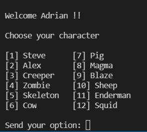
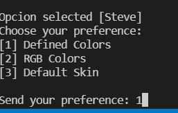
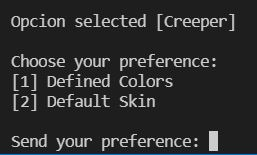
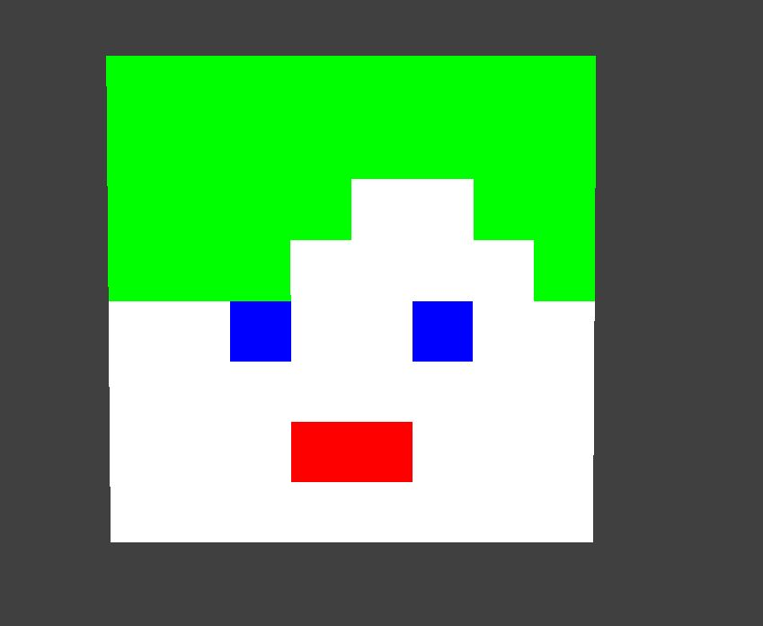
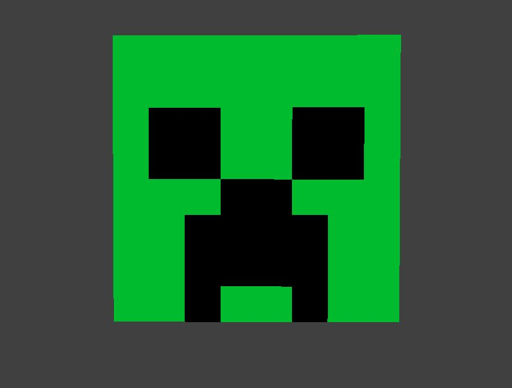

# **Practica Calificada 2**

- ## **Tema** 
  Ursina.
- ## **Descripción** 
  
  Modificación de Skin de Minecraft a base de la libreria Ursina 

- ## **Integrantes **
  1. Adrian Auqui Perez

  2. Diego Bustamante Palomino

  3. Jhostin Ramos Poma

  4. Gian Arteaga Alvarez

- ## **Skin Minecraft Creator**

  Skin_Minecraft_Creator.py es el archivo principal de nuestro proyecto , que une las funciones **(menu 2 y menu 3)** acompañado de una interfaz de selección de nuestro personaje.
  En todos los personajes tienen incluidos dos funciones .Uno que es para que el usuario modifique a su gusto y el otro es para tener los colores originales del personaje           seleccionado.

  
- ## **Menus** 
  - ### Menu 2 

    El menu 2 es una funcion que ayuda a modificar los colores del personaje con RGB personalizado,colores orginales del mismo personaje o con los colores que Ursina.Esta funcion solo se usa para los modelos **Steve** y **Alex**.

    
  - ### Menu 3

    El menu 3 es una funcion que modifica los colores del personaje con los colores de Ursina (podemos escoger dos tonalidades a nuestro personaje) o colores originales del personaje.Esta funcion se usa para todos excepto   **Steve** y **Alex**. 

    
- ## Funcion Personaje

  Cada personaje tiene dos funciones que ayudan a personalizar los colores o para poner los colores predeterminados.
  - ### Steve y Alex 
    Estos personajes tienen la funcion **"personaje"_default( )** y **"personaje"(skin,mouth,eyes,hair)**
    
  - ### Mobs 
    Estos personajes tienen la funcion **"personaje"_default( )** y **"personaje"(primary_color,secundary_color)**

    

